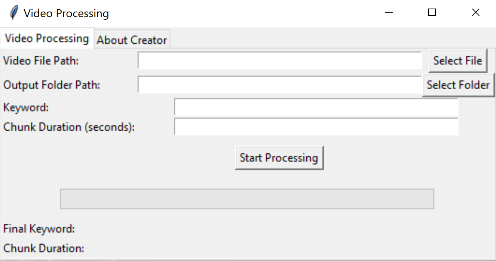
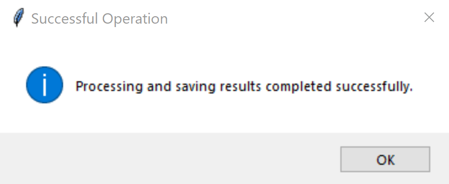
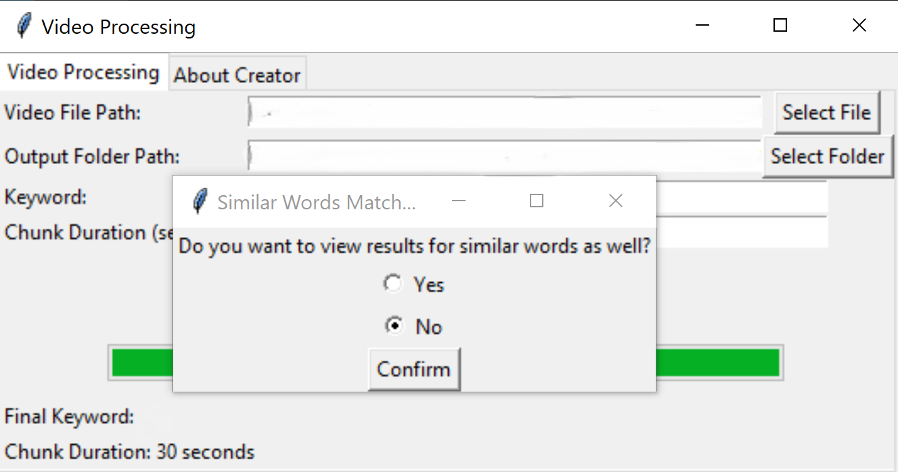
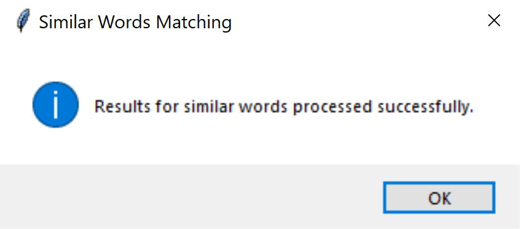
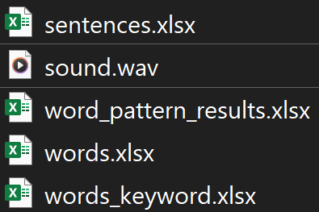
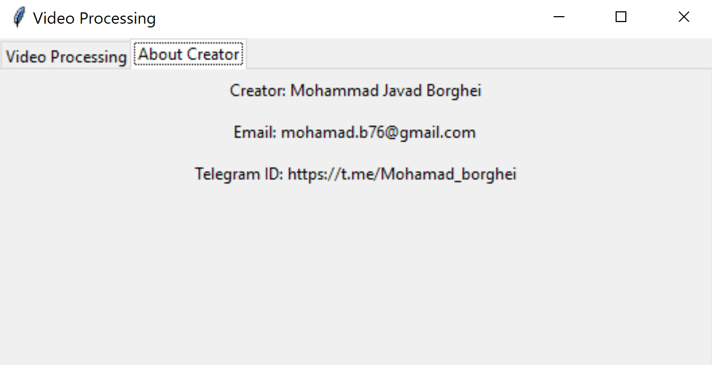

# Video Word Finder

Sometimes, you need to search for a specific word in a movie. 
Doing this manually can be time-consuming. With this project, 
you can quickly find out exactly when the word you’re looking 
for appears by simply entering it into the program.

## Features: 
1. Recognizing the desired word and when that word was said in the movie
2. Recognize all the sentences spoken in the video
3. Recognizing all the words and when they were said in the movie
3. Find words similar to the keyword from most similar to least similar in order, 
   and when these words were said in the movie

## Installation and commissioning
### **First, we install the prerequisites:**
pip install tk==0.1.0

pip install moviepy==1.0.3

pip install pydub==0.25.1

pip install pandas==2.2.2

pip install SpeechRecognition==3.11.0

pip install openpyxl==3.1.5

#### Note:
**Please ensure that FFMPEG is installed before using the pydub library.
You can refer to the link below for assistance with the installation:**

[FFMPEG for download](https://ffmpeg.org/download.html#build-windows)

[Installation guide FFMPEG](https://www.geeksforgeeks.org/how-to-install-ffmpeg-on-windows/)

### **How to run the program :** 
1. You open the [main_tk](main_tk.py) file
   And you run it in Python IDE 
2. In part Video File Path, enter the path of the input video in MP4 format.
3. In the "Output Folder Path" section, specify the directory where you'd like to save the output files.
4. In the "Keyword" field, enter the word you want to search for in the movie.
5. The program splits the movie into smaller segments for processing. In the "Chunk Duration (seconds)" field, specify the duration (in seconds) for each segment.
   A default value of 30 seconds is recommended.
6. Click the Start Processing button to start

#### Note:
**You may enter the keyword and chunk duration into a model that may change after preprocessing. To ensure clarity about the final chunk value and the keyword submitted for final processing, the program will display their final values at the bottom of the opened window.**

7. When you see the following message, it means that the program has finished successfully.

8. Once the program completes successfully, a message will prompt you to choose whether you'd like to receive a list of similar words and their timestamps.

9. After seeing the message below, this section will end successfully

### **result:**

- sentences: This file contains all the dialogue from the movie.
- sound : The sound of the movie is in .wav format
- word_pattern_results : Words similar to the keyword
- words : All the words spoken in the movie
- words_keyword : 
Keywords with their timestamps in the movie

10. **In the second tab of the program, you can view my profile and find ways to contact me regarding the program's development.**

## Notice:
This repository is still under developing. For contributing contact me by email: mohamad.b76.mb@gmail.com  To create pull requests for this repository please choose just these branches: issue, refactor and feature

## LICENSE:
This project is licensed under the **[CC BY-NC 4.0](LICENSE.md)** license with additional terms for commercial use. You are free to share, copy, and modify the code for **non-commercial purposes**, with proper attribution.

For **commercial use**, you must obtain permission from the author and negotiate a revenue-sharing agreement.

For inquiries, please contact [mohamad.b76@gmail.com](mailto:mohamad.b76@gmail.com).